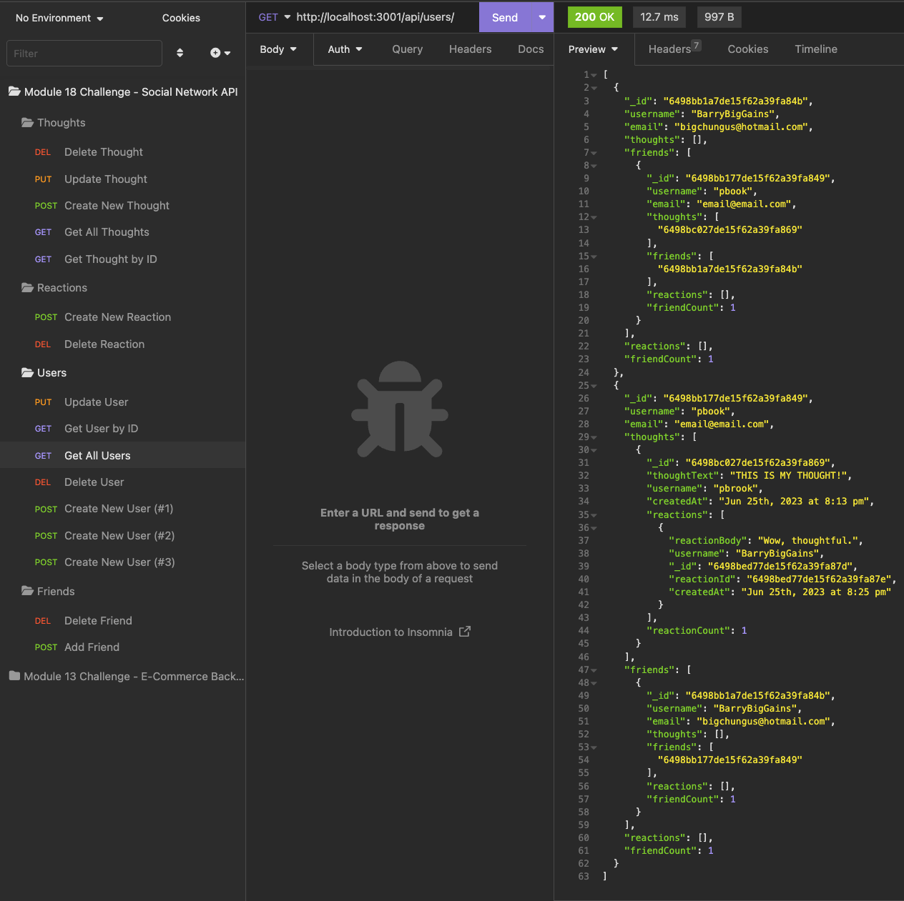

# NoSQL Social Network API 

## Description 
This application is a social network API that uses a NoSQL database. As a backend, it allows for the creation, editing, and deletion of a new user. That user can then add others as friends, share their thoughts, and react to other users' thoughts. It uses Express.js for routing, a MongoDB database, and the Mongoose ODM.

## Table of Contents

* [Installation](#installation)
* [Usage](#usage)
* [Credits](#credits)
* [License](#license)
* [Features](#features)
* [Contributing](#contributing)
* [Tests](#tests)
* [Questions](#questions)

## Video Demonstration
[Link to video demonstration](https://drive.google.com/file/d/1GHbUdjWUwDYSEtEFZv2g1Pu2ZRzAXn1T/view)

## Screenshot

## Installation 
Clone this repository to your local machine. Then, navigate to the root directory of the project in your terminal and run `npm install` to install the dependencies. You will also need to have MongoDB installed on your machine. Once you have done that, run `npm start` to start the server. You can then use Insomnia Core to test the routes.

## Usage 
This application is not deployed, so you will need to run it locally. Once you have started the server, you can use Insomnia Core to test the various social network routes. You can create, edit, and delete users, add friends, share thoughts, and react to thoughts.

## Credits 
N/A

## License
This application is covered under the [MIT](https://opensource.org/licenses/MIT) license.

## Features 
This project features the use of Express.js, MongoDB, and Mongoose, with Insomnia Core for testing.

## Contributing 
N/A

## Tests 
N/A

## Questions 
* You can find me on GitHub at [PBodyBrooks](https://github.com/PBodyBrooks). 
* Please do not hesitate to reach out to me via my email: parkerlamarbrook@gmail.com.
